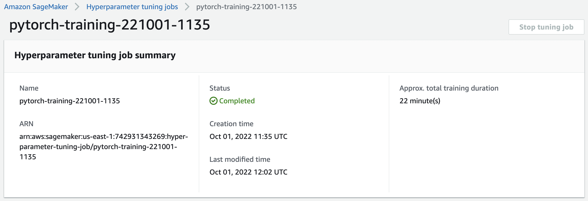
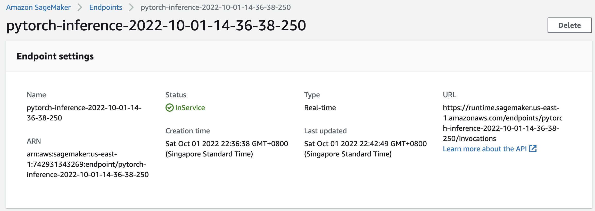

### Source:
https://github.com/udacity/CD0387-deep-learning-topics-within-computer-vision-nlp-project-starter

# Project: Image Classification using AWS SageMaker

## Repo Structure
This repo contains below files and folders:
- train_and_deploy.ipynb: project notebook with key results displayed
- train_and_deploy.html : project notebook in html format
- hpo.py                : python script for hyperparameter tuning
- train_model.py        : python script for model training, debugging and profiling
- inference.py          : python script for model deployment
- profiler-report.html  : profiler report in html format
- img                   : image folder containing images used in the project report

## Project Overview
In this project, an image classification model was trained on AWS SageMaker using a pretrained ResNet-50 model and a dog breed classification dataset. Hyperparameter tuning, debugging and profiling were employed for the model training. The best model was then deployed to a Sagemaker Endpoint. The endpoint could be queried with a sample dog image to predict the dog's breed.

## Dataset
The dog breed classification dataset used in this project contains images from 133 dog breeds divided into training, testing and validation datasets. The dataset is first downloaded from [here](https://s3-us-west-1.amazonaws.com/udacity-aind/dog-project/dogImages.zip) and then uploaded to S3 for model training using SageMaker.

## Hyperparameter Tuning
ResNet-50 is chosen for the model training due to its higher accuracy. Hyperparameters chosen include batch_size(ranging from 32 to 256), epochs(ranging from 2 to 4) and learning rate(ranging from 0.001 to 0.1). These ranges are chosen in consideration of training memory usage, training time and model accuracy.

A successful hyperparameter tuning job:




The best hyperparameters among the training jobs are: batch_size=256, epochs=3, lr=0.00105260174375438.


## Debugging and Profiling
Using the best hyperparameters, a new model was created and finetuned with debugging and profiling enabled:
1. Debugger and profiler rules were added in the rules list.
2. The debugger and profiler configurations were created.
3. The debugger hook was created and added to the train and test functions in the training script.
4. An estimator was created to train the model using the training script.
5. The debugging/profiling results could then be queried and plotted.

### Results
Training result:
```
Training Set: Epoch 1: Loss 3.2254936695098877,             Accuracy 42.66686620772224%
Training Set: Epoch 2: Loss 1.1401318311691284,             Accuracy 80.035917390003%
Training Set: Epoch 3: Loss 0.6871131658554077,             Accuracy 87.00987728225083%
Testing Model on Whole Testing Dataset
Test set: Average loss: 0.7401, Accuracy: 689/837 (82%)
```
There is no obvious anomalous behavior in the debugging output. If there were LossNotDecreasing issue, I would implement an early stopping logic to stop training when a predefined loss threshold was achieved.
However, there was LowGPUUtilization which indicated that a smaller instance type could be chosen instead. The profiler report is provided in the project folder.

## Model Deployment
To allow easier model deployment and redeployment, the best model was saved in S3. It could be loaded for deployment to a SageMaker Endpoint using the inference.py script. The endpoint could be invoked by the BytesIO streams of a sample dog image to make prediction of the dog's breed.

Screenshot of a deployed active endpoint in SageMaker:



In the several invocations made, as shown in the project notebook, the model correctly predicted the dog's breed.
